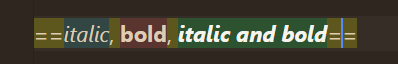
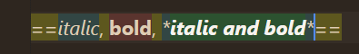
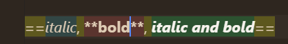
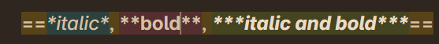
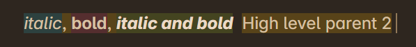
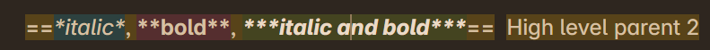
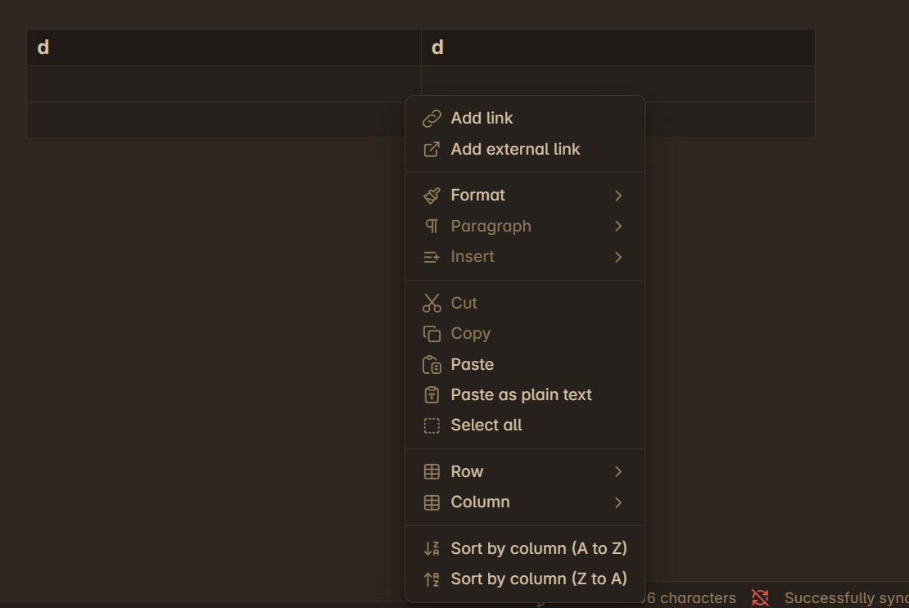
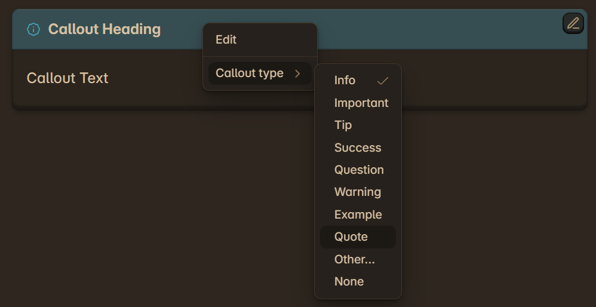

Date : 14-09-2025

After a long time away from the project (approx 2 months), I have returned to see the state that I left it in. Everything is working as intended. This was good news but did not came as a surprise as over the course of June to July, I had exprimented with a older prototype project now broken (Obsidian-JS). Using what I had learnt from that attempt, I scrapped what I could and created a better system with the help of AI. I still wish codeMirror was easier to use and that the project was more organised. 

I planned for my long distance and exit from the project and made sure everything works and yes everything is working how I left it. The problem is that there is still a lot to do.

# TODO

## Clean Up the Project Files and add Docs.

## Implement feature: keep connected or interlaced markdown syntax open while editing

As you can see from the images below, editing can be quite frustrating if the markdown sytax keeps hidding and showing. 

Instead, when editing the text it should keep all markdown syntax open that is part of the same **High level** parent.

It should avoid opening up other **High Level** parents. For example, in the example below there are two Highlevel parents

This is a core feature that will greatly improve user experience. 

---

## Improve Color Scheme and Style

1. Improve current theme
2. Implement Light Mode
3. Implement a more easier to read theme like obsidan's default theme as the highilighting issue will most likely never get fixed

## Implement proper Indentation support for Lists and blockquotes

- Lists Need a verticle bar that can help tell what level it is in the indentation

- Indentation is broken for blockquotes

- Blockqoutes also need a verticle bar that can help tell what level it is in the indentation

- Optionally : Add a keybind that add spaces so there can be regular tabs too 

## Escape Key

current when typing the Escape Key, the escape key work but it is not treated as a syntax to be hidden so it never hides. We need it to hide when not editing.

## Add Table support (GFM Markdown)

We need to add proper naviagtion, and this small popup window to modifiy the table

## Add Callout Support 

we need to add this callout support.

Add support markdown inside of callouts too.

## Add Support for HTML

- inline HTML
- Full Line HTML

## Building the Markdown Editor

- Should look like the Obsidian Editor.
- Should have a Toolbar.
- Have Filesystem Support (local files for now)

## Add Images and other files Suppport

## Host the Database and switch from local Files to Cloud Storage